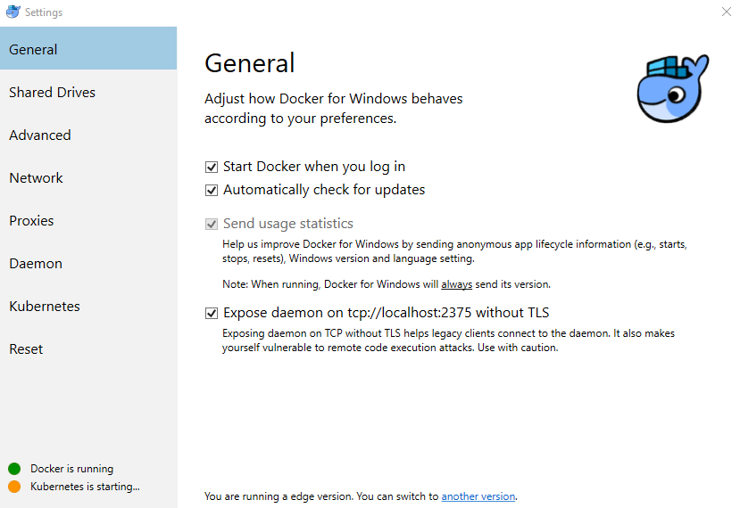

# Windows 10 build 1803

## Enable Windows Subsystem for Linux (WSL)

Open `PowerShell` as Administrator and run

    PS > Set-ExecutionPolicy -ExecutionPolicy Unrestricted
    
    PS > Enable-WindowsOptionalFeature -Online -FeatureName Microsoft-Windows-Subsystem-Linux

Restart your computer when prompted.

## Before WSL configuration
### WSL
Install <a href="https://www.microsoft.com/pt-br/p/ubuntu-1604/9pjn388hp8c9">Ubuntu 16.04</a>

### Docker

For Docker on WSL to work you must install and expose the Docker Windows Deamon on tcp://localhost2375, this can be done by acessing General Settings on <a href="https://store.docker.com/editions/community/docker-ce-desktop-windows">Docker for Windows</a>:

## Configuring WSL
Run `bash` command, wait for Ubuntu to install and choose a username and password for your distro.

You can now follow [UBUNTU1604.md](./UBUNTU1604.md) and configure your development environment.

## After WSL configuration

### X Window System
To run an X Window application, like Terminator, you need to install an X Server, there are some options on Windows:

* <a href="https://sourceforge.net/projects/xming/">Xming</a>
* <a href="https://sourceforge.net/projects/vcxsrv/">VcXsrv</a>
* <a href="http://token2shell.com/x410/">X410</a>

Installation and configuration is up to you.

## Terminator natively on Windows
To run a new instance of Terminator, just double click `terminator.lnk`, just make sure [terminator.lnk](../terminator.lnk) and [terminator.vbs](../terminator.vbs) files are on the same directory.